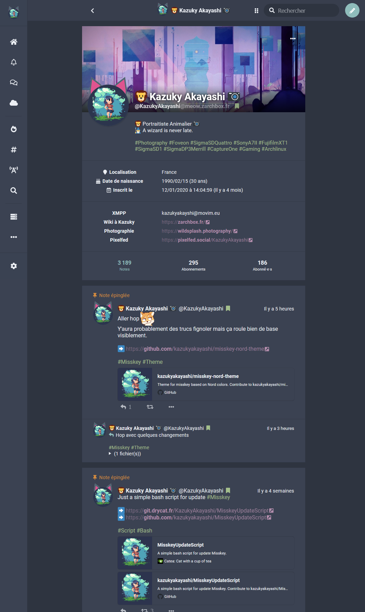
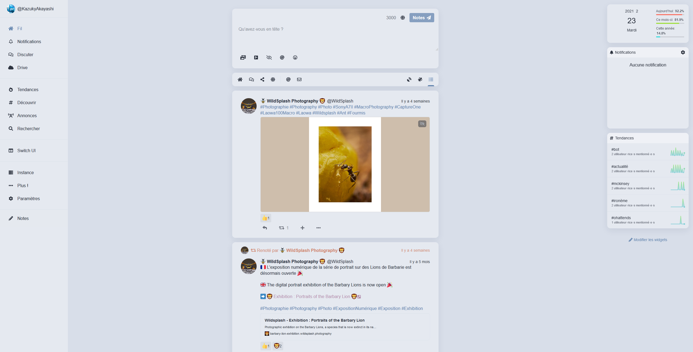

# Misskey Nord Theme
Theme for misskey based on [Nord theme color](https://www.nordtheme.com/#palettes-modularity).

## Use
Copy this code on misskey theme editor.

## Dark

```
{
	id: '5de572f1-608f-4e8b-9e48-62a519f0c7aa',

	name: 'Nord',
	author: '@kazukyakayashi@meow.zarchbox.fr',
	desc: 'Theme based on Nord theme color',

	base: 'dark',

props: {
	accent: '#8fbcbb',
	bg: '#2e3440',
	fg: '#eceff4',
	fgHighlighted: '@accent',
	panel: '#3b4252',
	navBg: '#3b4252',
	navFg: '@fg',
	navHoverFg: '@accent',
	navActive: '@accent',
	navIndicator: '#bf616a',
	indicator: '#bf616a',
	header: 'rgba(46, 52, 64, 0.75)',
	link: '#b48ead',
	mention: '#bf616a',
	hashtag: '#a3be8c',
	renote: '#d08770',
	cwFg: '#eceff4',
	pageBg: '@bg',
	badge: '#a3be8c',
	divider: 'rgba(46, 52, 64, 0.5)',
	driveFolderBg: '@panel',
	infoWarnBg: '#ebcb8b',
	infoWarnFg: '#2e3440',
	},
}
```

## Light 

```
{
	id: 'a99c9ac9-e23d-4770-934f-16419dfdd6c1',

	name: 'Light Nord',
	author: '@kazukyakayashi@meow.zarchbox.fr',
	desc: 'Theme based on Nord theme color',

	base: 'light',

	props: {
	accent: '#5e81ac',
	bg: '#d8dee9',
	fg: '#2e3440',
	fgHighlighted: '@accent',
	panel: '#e5e9f0',
	navBg: '#e5e9f0',
	navFg: '#2e3440',
	navHoverFg: '@accent',
	navActive: '@accent',
	navIndicator: '@accent',
	header: 'rgba(229, 233, 240, 0.75)',
	link: '#b48ead',
	mention: '#bf616a',
	hashtag: '#5e81ac',
	renote: '#d08770',
	pageBg: '@bg',
	badge: '#d08770',
	divider: 'rgba(216, 222, 233, 0.7)',
	driveFolderBg: '@panel',
	infoWarnBg: '#ebcb8b',
	infoWarnFg: '#2e3440',
	},
}
```

## In Stylus or Misskey CSS editor

```
/* bg for link preview */
.mk-url-preview > a > article {
    background-color: #343a4a;
}
```

## Screenshot

Dark theme


Light theme
