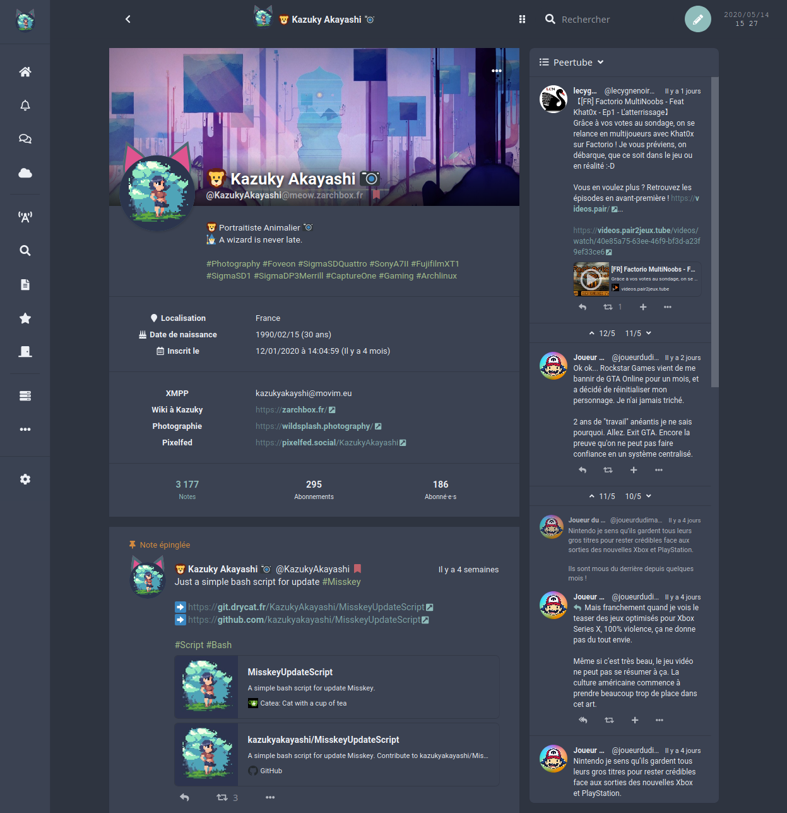

# Misskey Nord Theme
Theme for misskey based on [Nord theme color](https://www.nordtheme.com/#palettes-modularity).

# Use

Paste this on misskey.

```
{
	id: 'Nord2',

	name: 'Nord2',
	author: 'KazukyAkayashi',
	desc: 'Theme based on Nord theme color',

	base: 'dark',

	props: {
	accent: '#8fbcbb',
	tag:'#a3be8c',
	bg: '#2e3440',
	fg: '#eceff4',
	panel: '#3b4252',
	header: 'rgba(46, 52, 64, 0.75)',
	renote: '#17bf63',
	link: '@accent',
	mention: '@accent',
	hashtag: '@tag',
	renote: '#bf616a',
	pageBg: '@bg',
	badge:'#bf616a',
	divider:'rgba(46, 52, 64, 0.7)',
	driveFolderBg:'@panel',
	},
}
```

# Screenshot


